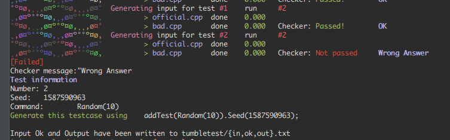

This examples showcases what happens when stress-testing bad solutions.

Using the command `TestSources(200, "bad.cpp");` the solution `bad.cpp` will be tested 200 times with all the test cases added up to this point.

Testing multiple sources can be done using `TestSources(200, {"bad.cpp", "bad2.cpp");`

It's guaranteed that
- the first run will be made on the test final version of the testcases (the test cases that will be generated)
- the number of runs (200 above) is the number of additional runs that will be made using the same call functions eg: `Rand(100)` using different seeds all of the time.

In case a test cases was found on which one of the sources did not pass the `checker` the following message will be printed:

